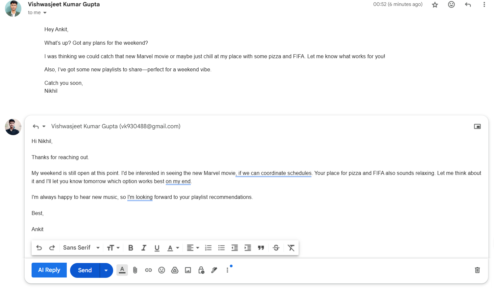
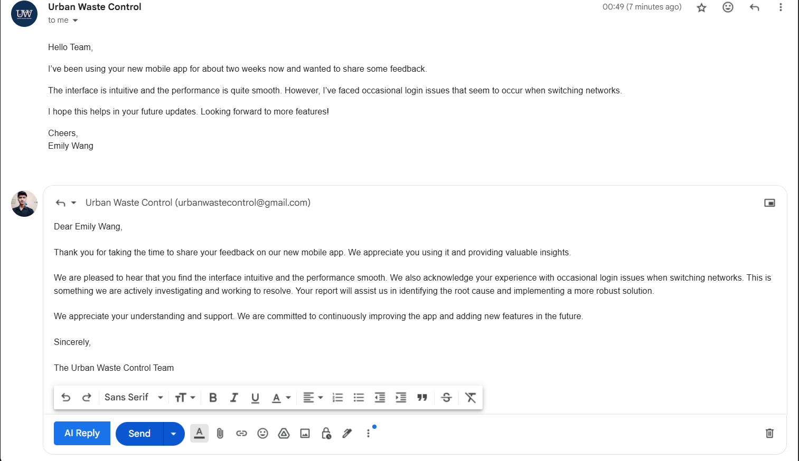

# 📬 ChronoMailAI – Smart Email Assistant powered by Gemini

ChronoMailAI is your intelligent AI email assistant designed to write, summarize, and auto-respond to emails with just one click. Built with **Gemini AI**, it integrates **React.js** frontend, **Spring Boot** backend, and a **Chrome Extension** for seamless browser integration.

---

## 🚀 Features

✨ **Smart Email Replies** – Auto-generate professional responses using Gemini AI  
🧠 **AI Summarization** – Get concise summaries of lengthy emails  
📩 **Email Templates** – Create reusable and dynamic email drafts  
🌐 **Chrome Extension** – Use directly within Gmail interface  
🔐 **Secure API Access** – Gemini API key management built-in  
📊 **Performance Optimized** – Lightweight and responsive UI

---

## 🛠️ Tech Stack

| Layer       | Technology                    |
|-------------|-------------------------------|
| Frontend    | React.js, Tailwind CSS        |
| Backend     | Spring Boot (Java)            |
| AI Engine   | Google Gemini 2.0 API         |
| Extension   | JavaScript, Chrome API        |
| Build Tool  | Vite                          |
| Versioning  | Git + GitHub                  |

---

## 📁 Project Structure

ChronoMailAI/<br>
├── email-writer-react/ # React Frontend<br>
├── email-writer-sb/ # Spring Boot Backend<br>
├── email-writer-ext/ # Chrome Extension<br>
├── hello-world-ext/ # Sample Extension Demo<br>
└── email-writer-sb.zip # Zipped backend (for deployment)

---

## 🔧 Setup Instructions

### 1. Clone the Repository

```bash
git clone https://github.com/your-username/ChronoMailAI.git
cd ChronoMailAI
```
### 2. Start the Backend (Spring Boot)

```bash
cd email-writer-sb
./mvnw spring-boot:run
```
- Make sure your .env or application.properties contains:
gemini.api.url=YOUR_URL
gemini.api.key=YOUR_KEY

### 3. Start the Frontend (React + Vite)
```bash
cd email-writer-react
npm install
npm run dev
```
### 4. Load Chrome Extension
- Open Chrome and go to chrome://extensions/

- Enable Developer Mode

- Click Load Unpacked

- Select the email-writer-ext/ folder


---

## 📸 Screenshots
- Working of ChronoMail AI

- AI Reply Option

- Reply is Generated based on Sender's Tone

- Reply based on the Sender's Subject


## 🧠 Powered By
- [Google Gemini API](https://ai.google.dev/)
- [React](https://react.dev/)
- [Spring Boot](https://spring.io/projects/spring-boot)
- [Chrome Extensions](https://developer.chrome.com/docs/extensions/)


---

## 📌 Roadmap
 - Auto email generation

 - Chrome extension integration

 - Gmail OAuth API integration

 - Multilingual support

 - Personalized writing styles (tone/formal/casual)

 
---

## 👨‍💻 Author

**Vishwasjeet Kumar Gupta**  
BTech CSE | FullStack Developer  

[](https://www.linkedin.com/in/vishwasjeet-kumar-gupta-62814018a/)


---
<!-- ##📜 License
This project is licensed under the MIT License – see the LICENSE file for details. -->